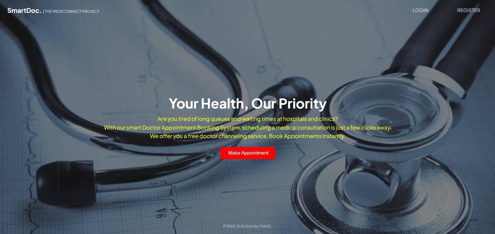
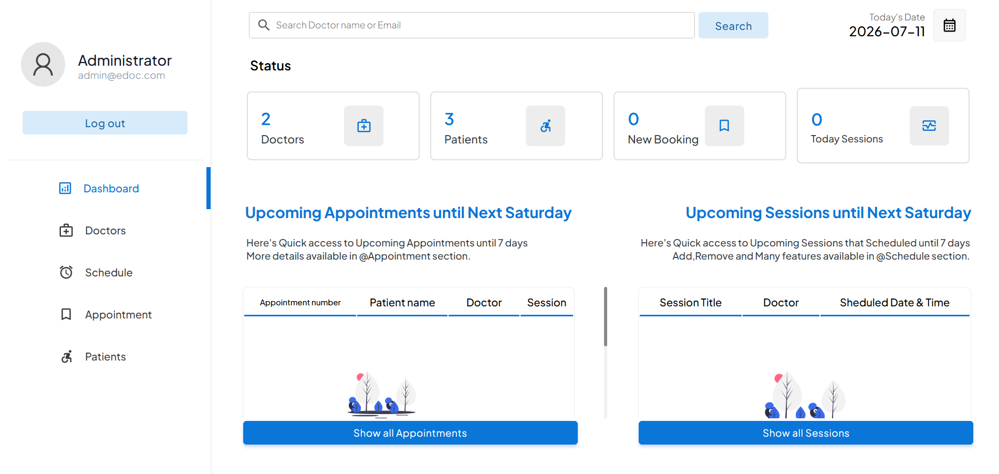
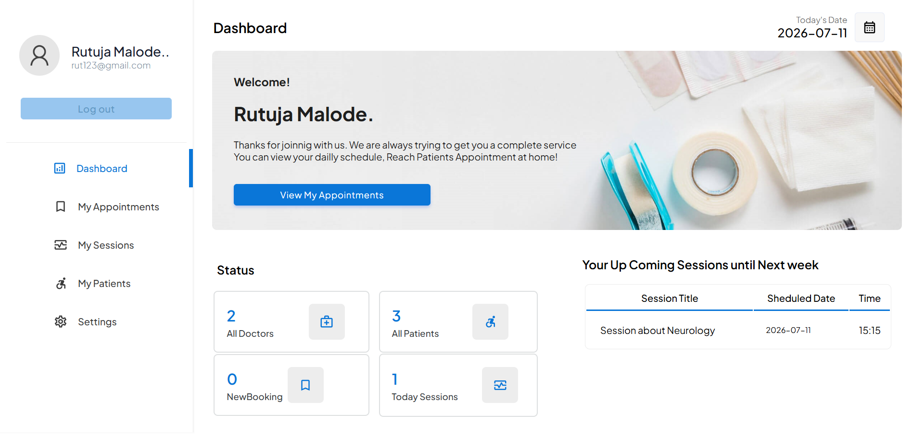
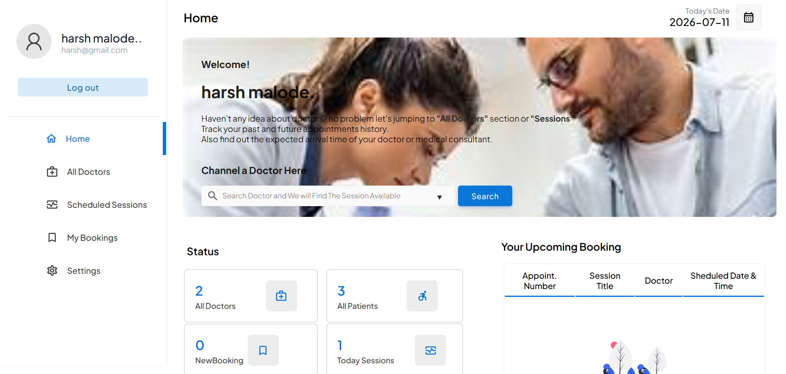
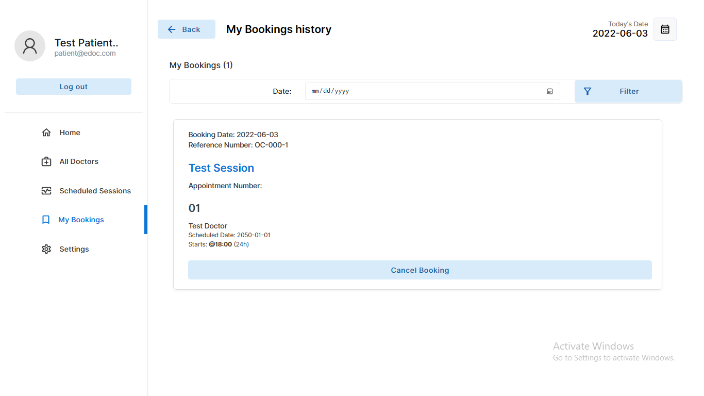
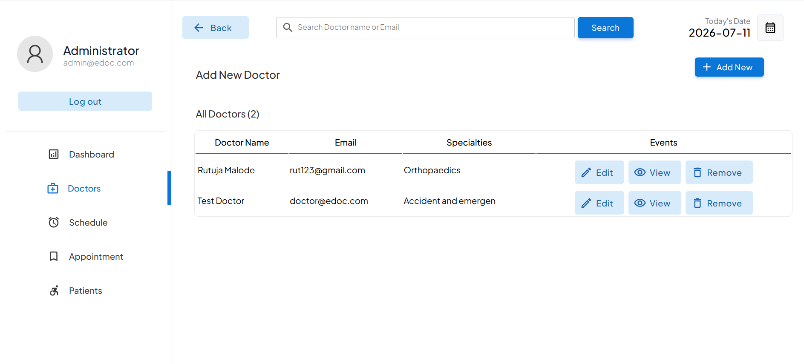

<h1 align="center">🏥 SmartDoc</h1>

<p align="center">
  
  
  
  
</p>

<p align="center">
  <b>Online Doctor Appointment Booking & Hospital Management System</b>
</p>
A modern web-based healthcare management system that enables patients to book appointments online, doctors to manage schedules, and administrators to efficiently manage hospital operations through a centralized platform.

🌐 **Live Demo:** Coming Soon

💻 **GitHub Repository:** https://github.com/HarshMalode/SmartDoc

---

# 📸 System Preview




---

# 🚀 Why eDoc?

- Managing hospital appointments manually often leads to scheduling conflicts, long waiting times, and inefficient communication.

- SmartDoc provides an online platform where patients can easily book appointments, doctors can manage schedules, and administrators can oversee hospital operations.

- The system improves appointment management, reduces paperwork, enhances communication, and delivers a better healthcare experience for both patients and healthcare professionals.

---

# ✨ Features

## 👤 Patient Module

Patients can:

- Register & Login
- Search Doctors
- Book Appointments
- View Appointment History
- Cancel Appointments
- Update Profile
- View Doctor Details

---

## 👨‍⚕️ Doctor Module

Doctors can:

- Secure Login
- Manage Appointment Schedule
- View Patient Appointments
- Accept or Reject Appointment Requests
- Update Availability
- Manage Profile

---

## 🛠️ Administrator Module

Administrators can:

- Manage Doctors
- Manage Patients
- Manage Appointment Schedules
- View All Appointments
- Add Doctor Specializations
- Manage Hospital Information
- Monitor System Activities

---

# 📊 Dashboard & Reports

Interactive dashboards provide:

- Total Doctors
- Total Patients
- Appointment Statistics
- Daily Bookings
- Upcoming Appointments
- Hospital Overview

---

# 🛡 Security Features

- Role-Based Authentication
- Secure Login
- Session Management
- Input Validation
- Protected Dashboards
- Database Security
- User Access Control

---

# 🛠 Technologies Used

## Frontend

- HTML5
- CSS3
- Bootstrap
- JavaScript

## Backend

- PHP

## Database

- MySQL

## Development Tools

- VS Code
- XAMPP
- Git
- GitHub

---

# 📂 Project Structure

```text
eDoc/
│
├── admin/
├── doctor/
├── patient/
├── css/
├── js/
├── images/
├── database/
├── screenshots/
├── includes/
├── index.php
├── login.php
├── signup.php
└── README.md
```

---

# 📸 Screenshots

<table align="center">
<tr>
<td align="center"><b>🏠 Home</b></td>
<td align="center"><b>🛠️ Admin Dashboard</b></td>
</tr>

<tr>
<td></td>
<td></td>
</tr>

<tr>
<td align="center"><b>👨‍⚕️ Doctor Dashboard</b></td>
<td align="center"><b>👤 Patient Dashboard</b></td>
</tr>

<tr>
<td></td>
<td></td>
</tr>

<tr>
<td align="center"><b>📅 Appointment Booking</b></td>
<td align="center"><b>📋 Manage Sessions</b></td>
</tr>

<tr>
<td></td>
<td></td>
</tr>
</table>

---

# 🌟 Applications

- Hospital Management
- Clinic Management
- Online Doctor Appointment Booking
- Healthcare Administration
- Patient Management
- Medical Scheduling
- Healthcare Information System

---

# 🚀 Installation

### Clone the repository

```bash
git clone https://github.com/HarshMalode/eDoc.git
```

### Move the project into XAMPP

Copy the project folder into:

```
C:\xampp\htdocs\
```

### Import Database

- Open phpMyAdmin
- Create a new database
- Import the provided SQL file

### Start XAMPP

- Apache
- MySQL

### Run the project

```
http://localhost/eDoc/
```

---

# BUILDING USER ACCOUNTS OF THIS PROJECT

- ADMIN EMAIL:		admin@edoc.com

  ADMIN PASSWORD:	123


- DOCTOR EMAIL:		doctor@edoc.com

  DOCTOR PASSWORD:	123


- PATIENT EMAIL:		patient@edoc.com

  PATIENT PASSWORD:	123

---

# 🚧 Future Enhancements

- Online Video Consultation
- Digital Prescription System
- AI-Based Symptom Checker
- Email Notifications
- SMS Notifications
- Online Payment Gateway
- Medical Report Upload
- Doctor Ratings & Reviews
- Mobile Application
- Cloud Deployment

---

# 🤝 Contributing

Contributions are welcome!

Feel free to:

- Fork the repository
- Create a feature branch
- Commit your changes
- Push to your branch
- Submit a Pull Request

---

# 📄 License

This project is licensed under the **MIT License**.

---

# 📬 Contact

👨‍💻 **Developed by:** Harshwardhan Malode

📧 **Email:** harshwardhanmalode798@gmail.com

🔗 **LinkedIn:** https://www.linkedin.com/in/harshwardhan-malode-226900386

🐙 **GitHub:** https://github.com/HarshMalode

🌐 **Portfolio:** Coming Soon

---

# ⭐ Support

If you found this project useful,

⭐ Star this repository

🔁 Share it with others

💼 Connect with me on LinkedIn

---

<h3 align = "center">❤️ Thank You for Visiting! </h3>
